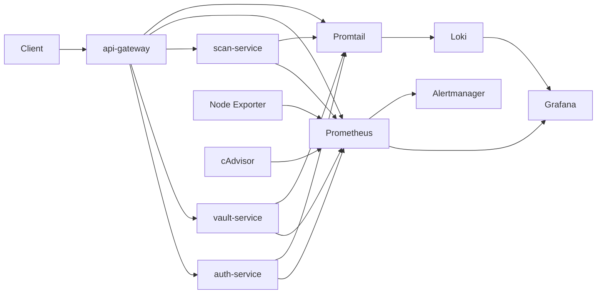

# Security Observability Platform

Production-style observability platform for a simulated security infrastructure stack. The project models the kinds of services you would expect in a security control plane, instruments them with metrics and logs, ships those signals into an observability stack, and supports deterministic incident simulation for alerting and triage workflows.

This repo is designed to answer a practical question: if a small security platform started failing in production, would we have the telemetry, dashboards, alerts, and runbooks needed to understand what happened and respond quickly?

## Project goals

- Build a small security-oriented service stack instead of a generic CRUD demo
- Instrument the platform with application, infrastructure, and security-event telemetry
- Visualize service health, security anomalies, and incident context in Grafana
- Fire alerts for realistic failure modes such as dependency loss, auth anomalies, latency spikes, and resource pressure
- Keep local development and EC2 deployment behavior as close as possible

## What is in the platform

### Simulated services

- `api-gateway`
  - public entrypoint into the platform
  - validates tokens with `auth-service`
  - proxies requests to `vault-service` and `scan-service`
  - tracks burst traffic, suspicious requests, and rate-limited clients
- `auth-service`
  - simulates login and token validation
  - emits failed login, invalid header, and token validation failure metrics
- `vault-service`
  - simulates a secrets backend
  - exposes dependency health and secrets access error signals
- `scan-service`
  - simulates queued scanning jobs
  - emits queue depth, backlog, duration, and worker health signals

### Observability stack

- `Prometheus` for metrics scraping, recording rules, and alert evaluation
- `Grafana` for dashboards and incident investigation
- `Alertmanager` for alert routing and grouping
- `Loki` and `Promtail` for log aggregation and triage context
- `Node Exporter` for host-level telemetry
- `cAdvisor` for container and runtime telemetry

## Key telemetry

### Reliability signals

- service uptime
- request rate
- p95 latency
- 5xx rate
- dependency health
- queue depth
- process CPU and memory
- host CPU, memory, disk, and network

### Security-flavored signals

- failed token validations
- invalid auth headers
- failed login spikes
- secrets access errors
- suspicious request spikes
- burst traffic by client
- rate-limited requests
- scan backlog growth

## Architecture



## Repository layout

```text
services/             FastAPI services for the simulated platform
shared/               shared config, logging, metrics, middleware, and app helpers
infra/                Docker Compose, Prometheus, Grafana, Alertmanager, Loki, Promtail
deploy/ec2/           EC2 bootstrap and deployment assets
scripts/incidents/    repeatable incident simulation scripts
docs/                 focused docs for architecture, dashboards, alerts, runbook, and AWS notes
tests/                service and infrastructure validation
project_details.md    deep-dive explanation of the full system
```

## Runtime entrypoints

- Hybrid operator console: [http://localhost:8000](http://localhost:8000)
- Auth service docs: [http://localhost:8001/docs](http://localhost:8001/docs)
- Vault service docs: [http://localhost:8002/docs](http://localhost:8002/docs)
- Scan service docs: [http://localhost:8003/docs](http://localhost:8003/docs)
- Grafana: [http://localhost:3000](http://localhost:3000)
- Grafana folder view: [http://localhost:3000/dashboards/f/security-observability/security-observability](http://localhost:3000/dashboards/f/security-observability/security-observability)
- Prometheus: [http://localhost:9090](http://localhost:9090)
- Alertmanager: [http://localhost:9093](http://localhost:9093)
- Loki: [http://localhost:3100](http://localhost:3100)

## Grafana login

- Username: `admin`
- Password: `observability-admin`

Grafana uses a normal login flow locally because anonymous mode produced permission-noise in the dashboard UI. The authenticated flow is cleaner and matches how an internal observability console is typically accessed.

## Quick start

### Prerequisites

- Python 3.10+
- Docker Desktop or Docker Engine with Compose

### Install local Python dependencies

```bash
python -m pip install -e .[dev]
```

### Start the full stack

```bash
docker compose -f infra/docker-compose.yml up --build -d
```

### Validate the stack

```bash
python -m pytest -q
python -m ruff check .
docker compose -f infra/docker-compose.yml config
```

## Typical workflow

### 1. Open the operator console

Use [http://localhost:8000](http://localhost:8000) to:

- see the current service summary
- jump into Grafana, Prometheus, Alertmanager, and Loki
- trigger incident simulations from one place

### 2. Open Grafana

Start with the folder view:

- [Security Observability folder](http://localhost:3000/dashboards/f/security-observability/security-observability)

Key dashboards:

- `Service Health`
- `Security Events`
- `Incident Triage`
- `Infrastructure`

### 3. Drive traffic through the platform

Get a token:

```bash
curl -X POST http://localhost:8001/login ^
  -H "Content-Type: application/json" ^
  -d "{\"username\":\"analyst\",\"password\":\"correct-password\",\"client_id\":\"soc-1\"}"
```

Use the gateway:

```bash
curl http://localhost:8000/vault/secrets/db-password ^
  -H "Authorization: Bearer token-analyst-soc-1"
```

Queue a scan:

```bash
curl -X POST http://localhost:8003/scan ^
  -H "Content-Type: application/json" ^
  -d "{\"target\":\"artifact-a\",\"client_id\":\"soc-1\"}"
```

## Incident simulation

The platform includes deterministic incidents so the dashboards and alerts can be demonstrated on demand.

Apply incidents:

```bash
python -m scripts.incidents.auth_latency --mode apply
python -m scripts.incidents.scan_backlog --mode apply
python -m scripts.incidents.vault_dependency_failure --mode apply
python -m scripts.incidents.gateway_token_spike --mode apply
python -m scripts.incidents.container_memory_pressure --mode apply
```

Reset stateful incidents:

```bash
python -m scripts.incidents.auth_latency --mode reset
python -m scripts.incidents.scan_backlog --mode reset
python -m scripts.incidents.vault_dependency_failure --mode reset
python -m scripts.incidents.container_memory_pressure --mode reset
```

Notes:

- `gateway_token_spike` is traffic-based, so it naturally decays as the Prometheus rate window ages out.
- alert timing is tuned for a local demo environment rather than a long-running production SRE setup

## What has been verified locally

- full Docker Compose startup
- healthy Prometheus scrape targets
- Grafana provisioning and dashboard loading
- Loki ingestion and log visibility
- gateway-to-service authenticated traffic
- alert firing for dependency failure and token validation spike
- browser-level checks across the operator console, dashboards, Prometheus, Alertmanager, and service docs

## Deployment model

The default runtime is local Docker Compose, but the repo also includes an EC2 deployment path under `deploy/ec2/`. The intention is:

- local development remains free and easy to run
- deployment structure still looks production-minded
- the same service topology is preserved across local and EC2 modes

## Additional documentation

- [docs/architecture.md](docs/architecture.md)
- [docs/alerts.md](docs/alerts.md)
- [docs/dashboards.md](docs/dashboards.md)
- [docs/runbook.md](docs/runbook.md)
- [docs/aws-comparison.md](docs/aws-comparison.md)
- [project_details.md](project_details.md)

## Portfolio notes

This project works well as a resume or interview artifact because it demonstrates:

- service instrumentation design
- observability architecture choices
- incident simulation and triage
- alert design and threshold reasoning
- documentation and operational thinking
- cloud deployment awareness without requiring a permanently paid environment
