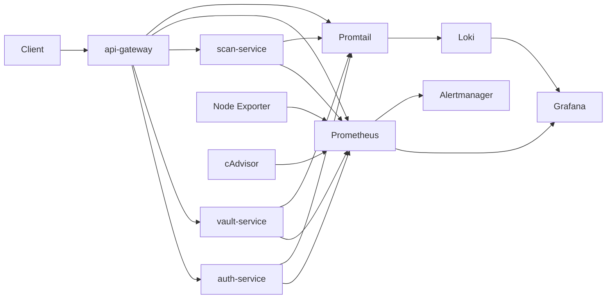

# Security Observability Platform

Cloud-deployed observability platform with local parity for a simulated security infrastructure stack. This project models a small security control plane, instruments it with Prometheus metrics and structured logs, visualizes it in Grafana, routes alerts through Alertmanager, and supports deterministic incident simulations for auth failures, dependency loss, queue backlog, latency spikes, and container pressure.

## What this project demonstrates

- Security-focused service instrumentation, not just generic backend metrics
- Prometheus-based application and infrastructure monitoring
- Grafana dashboards for service health, infrastructure, security events, and incident triage
- Alerting for downtime, latency, dependency health, auth anomalies, queue pressure, and resource stress
- Loki log correlation for metric-driven incidents
- EC2 deployment assets with Docker Compose parity

## Architecture



## Services

- `api-gateway`
  - public entrypoint
  - validates tokens through `auth-service`
  - proxies to `vault-service` and `scan-service`
  - tracks burst traffic, suspicious spikes, and rate-limited requests
- `auth-service`
  - `POST /login`
  - `POST /validate`
  - emits failed login, invalid header, and token validation metrics
- `vault-service`
  - secrets access endpoint
  - dependency health and secrets access error simulation
- `scan-service`
  - queued scan jobs
  - queue depth, backlog, duration, and failure metrics

## Observability stack

- `Prometheus` for scraping and alert evaluation
- `Grafana` for dashboards
- `Alertmanager` for alert routing
- `Loki + Promtail` for structured log ingestion
- `Node Exporter` for host metrics
- `cAdvisor` for container metrics

## Repo layout

```text
services/        FastAPI services
shared/          shared config, logging, metrics, middleware
infra/           Docker Compose, Prometheus, Grafana, Alertmanager, Loki, Promtail
deploy/ec2/      EC2 bootstrap and service assets
scripts/incidents/ deterministic incident generators
docs/            architecture, alerts, dashboards, runbook, AWS comparison
tests/           service and infra validation
```

## Quick start

### Prerequisites

- Python 3.10+
- Docker Desktop or Docker Engine with Compose

### Install dependencies

```bash
python -m pip install -e .[dev]
```

### Start the platform

```bash
docker compose -f infra/docker-compose.yml up --build -d
```

### Endpoints

- API gateway: [http://localhost:8000](http://localhost:8000)
- Auth service: [http://localhost:8001](http://localhost:8001)
- Vault service: [http://localhost:8002](http://localhost:8002)
- Scan service: [http://localhost:8003](http://localhost:8003)
- Hybrid console: [http://localhost:8000](http://localhost:8000)
- Grafana: [http://localhost:3000](http://localhost:3000)
- Prometheus: [http://localhost:9090](http://localhost:9090)
- Alertmanager: [http://localhost:9093](http://localhost:9093)
- Loki: [http://localhost:3100](http://localhost:3100)

### Grafana access

- Anonymous viewer access is enabled for dashboard browsing.
- Admin login remains available with username `admin` and password `admin`.

## End-to-end flow

### 1. Get a token

```bash
curl -X POST http://localhost:8001/login \
  -H "Content-Type: application/json" \
  -d "{\"username\":\"analyst\",\"password\":\"correct-password\",\"client_id\":\"soc-1\"}"
```

### 2. Use the gateway

```bash
curl http://localhost:8000/vault/secrets/db-password \
  -H "Authorization: Bearer token-analyst-soc-1"
```

### 3. Queue a scan

```bash
curl -X POST http://localhost:8003/scan \
  -H "Content-Type: application/json" \
  -d "{\"target\":\"artifact-a\",\"client_id\":\"soc-1\"}"
```

## Dashboards

- `Service Health`
  - uptime
  - requests/sec
  - 5xx rate
  - p95 latency
  - dependency health
- `Infrastructure`
  - host CPU, memory, disk
  - container CPU and memory
  - network traffic
- `Security Events`
  - failed logins
  - token validation failures
  - secrets access errors
  - burst traffic and rate-limited requests
  - scan backlog depth
- `Incident Triage`
  - firing alert conditions
  - dependency state
  - recent Loki logs

## Incident simulations

Run the incidents from the repo root.

```bash
python -m scripts.incidents.auth_latency --mode apply
python -m scripts.incidents.scan_backlog --mode apply
python -m scripts.incidents.vault_dependency_failure --mode apply
python -m scripts.incidents.gateway_token_spike --mode apply
python -m scripts.incidents.container_memory_pressure --mode apply
```

Reset examples:

```bash
python -m scripts.incidents.auth_latency --mode reset
python -m scripts.incidents.scan_backlog --mode reset
python -m scripts.incidents.vault_dependency_failure --mode reset
python -m scripts.incidents.container_memory_pressure --mode reset
```

Notes:

- `gateway_token_spike` is traffic-driven rather than stateful. It clears naturally as the Prometheus 5-minute rate window ages out, or immediately if Prometheus is restarted during local testing.
- Alert hold times are tuned for local demos, while the rate calculations still use Prometheus recording rules.

## Validation

```bash
python -m pytest -q
python -m ruff check .
docker compose -f infra/docker-compose.yml config
```

## Verified locally

This repo has been validated locally for:

- service startup through Docker Compose
- Prometheus target health across app and infra targets
- Grafana health and provisioning
- Loki ingestion
- authenticated gateway-to-vault traffic
- incident-driven `SecurityDependencyUnhealthy` firing
- incident-driven `TokenValidationSpike` firing through Alertmanager

## AWS / EC2

The project includes `deploy/ec2/` assets for a single-host EC2 deployment using the same Docker Compose topology as local development, plus CloudWatch comparison notes in [docs/aws-comparison.md](docs/aws-comparison.md).

## Documentation

- [Architecture](docs/architecture.md)
- [Alerts](docs/alerts.md)
- [Dashboards](docs/dashboards.md)
- [Runbook](docs/runbook.md)
- [AWS comparison](docs/aws-comparison.md)

## Suggested screenshots for a portfolio or resume

- Service Health dashboard under normal traffic
- Security Events dashboard during token validation spike
- Incident Triage dashboard with a firing alert
- Alertmanager active alert list
- Prometheus target page showing all services `up`
